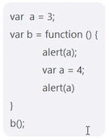

1. 一个页面有好多数据，如何渲染页面不卡
2. 看题

3. 看题
c 打印结果是啥？
如何打印到4
如何打印到5——var c = b.getA.call(window).call(b);

```js
var a = 3;
var b = {
    a: 4;
    getA: function(){
        this.a = 5;
        return function(){
            return this.a;
        }
    }
}
var c = b.getA();
```

4. get和post区别
5. 页面初始展示为0，页面刷新一次，展示的数字加1
6. 同一个窗口下，另一个tab页面同步刷新
7. 图片无缝轮播实现
8. 数组去重
9. 页面的路由的形式——哈希和history
10. 多页面和单页面区别
11. 阿里项目用到的技术栈
12. ssr渲染
13. antd和fution区别
14. 前端性能指标有哪些？
